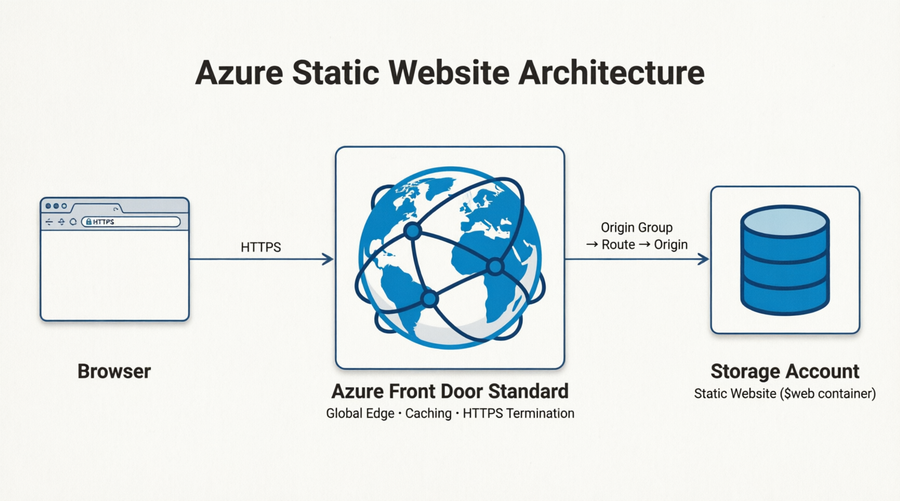

# Azure Project 1 — Static Site Hosting (Storage Account + Front Door)

Mirrors AWS Project 1 (S3 + CloudFront). A static website hosted on an Azure
Storage Account, served globally via Azure Front Door Standard, with the entire
infrastructure defined as code in Bicep.

**Live URL:** https://ademp1-afd-endpoint-hjcrgwd6bkaxahh5.z03.azurefd.net

## Architecture

Browser
| HTTPS
v
Azure Front Door Standard (global edge, caching, HTTPS termination)
| origin group -> route -> origin
v
Storage Account static website ($web container)




## Why Front Door instead of Azure CDN

Azure CDN (classic) stopped supporting new profile creation as of August 15, 2025
(Microsoft is retiring it in favor of Front Door). This project uses **Azure Front
Door Standard**, the current Microsoft-recommended replacement. Front Door uses a
different resource model than classic CDN:

| Classic CDN | Front Door Standard |
|---|---|
| Profile + single Endpoint | Profile + Endpoint + Origin Group + Origin + Route |
| Origin defined directly on endpoint | Origins grouped separately, support load balancing/failover |
| Domain implied by default | Route must explicitly set `linkToDefaultDomain` |

## An honest note on the AWS comparison

AWS's S3 + CloudFront + OAC pattern keeps the S3 bucket fully **private** — only
CloudFront can read from it. Azure's static website hosting works differently: it
requires the Storage Account's `$web` container to be public by design once static
website hosting is enabled. There isn't a direct Azure equivalent to OAC for this
specific scenario — Front Door adds caching, global distribution, and a custom HTTPS
edge on top, but the origin itself is publicly reachable directly, unlike the AWS setup.

## Resources in `main.bicep`

| Resource | Purpose |
|---|---|
| `storageAccount` | Holds the site files; static website hosting enabled on the `$web` container |
| `afdProfile` | The Front Door profile container (Standard SKU) |
| `afdEndpoint` | The public-facing edge endpoint (`*.azurefd.net`) |
| `originGroup` | Groups one or more origins; handles health probing and load balancing |
| `origin` | Points at the Storage Account's static website hostname |
| `route` | Wires the endpoint to the origin group; enforces HTTPS, matches all paths |

## Deploy

```bash
# 1. Create a resource group
az group create --name project1-static-site-rg --location eastus

# 2. Deploy the Bicep template
az deployment group create \
  --resource-group project1-static-site-rg \
  --template-file main.bicep \
  --parameters storageAccountPrefix=yourprefix

# 3. Get the storage account name from outputs
az deployment group show \
  --resource-group project1-static-site-rg \
  --name main \
  --query "properties.outputs.storageAccountName.value" -o tsv

# 4. Enable static website hosting on the storage account
az storage blob service-properties update \
  --account-name <storage-account-name> \
  --static-website --index-document index.html --404-document index.html

# 5. Upload site files
az storage blob upload-batch \
  --account-name <storage-account-name> -d '$web' -s ./site

# 6. Get the live Front Door URL
az deployment group show \
  --resource-group project1-static-site-rg \
  --name main \
  --query "properties.outputs.frontDoorUrl.value" -o tsv
```

## Updating the site later

```bash
az storage blob upload-batch --account-name <name> -d '$web' -s ./site --overwrite
```

Front Door caches content at the edge, so changes may take a few minutes to
propagate globally, similar to a CloudFront cache invalidation delay.

## Real debugging notes

**Storage account name too long:** Azure storage account names must be 3-24
characters, lowercase/numbers only. The original template concatenated a prefix
with a `uniqueString()` hash and exceeded the limit. Fixed with `take(..., 24)` to
guarantee a safe length regardless of the prefix chosen.

**Azure CDN (classic) rejected new profile creation:** hit a `BadRequest` error
stating classic CDN no longer supports new profiles. Confirmed via Microsoft's own
retirement documentation (retired for new profiles as of Aug 15, 2025) and rebuilt
the template using Front Door Standard's origin group / route model instead.

**Front Door route rejected with "at least one domain is required":** Front Door
requires explicitly opting into using the endpoint's own default `.azurefd.net`
domain via `linkToDefaultDomain: 'Enabled'` on the route — unlike classic CDN,
which assumed this by default. A deliberate Microsoft design choice to avoid
silently exposing routes on unacknowledged domains.

**Initial 404 despite a working origin:** tested the storage static website URL
directly and got a clean `200 OK`, isolating the problem to Front Door specifically
rather than the upload or origin config. Route configuration (enabled state, origin
group binding, path patterns) all checked out correctly via `az afd route show`.
The actual cause was first-deployment propagation delay across Front Door's global
edge network — took roughly 5-8 minutes to fully resolve, notably longer than
CloudFront's typical propagation time.

## Tear down

```bash
az group delete --name project1-static-site-rg --yes --no-wait
```

Deleting the resource group removes every resource inside it in one command —
one of the genuine advantages of Azure's resource group model over needing to
track and delete AWS resources individually or via a CloudFormation stack.

## Cost

Storage Account (Standard_LRS): negligible for a small static site. Front Door
Standard has a small monthly base fee plus usage-based charges for requests and
data transfer — free tier / trial credits typically cover this comfortably at
portfolio-demo traffic levels. Recommend deleting the resource group when not
actively demoing to avoid the Front Door base fee accumulating.

## What this project demonstrates

- Static site hosting on Azure Storage with Front Door as CDN
- Bicep as Azure's native IaC language (compiles to ARM under the hood)
- Adapting to a real platform deprecation (classic CDN to Front Door) using live
  documentation rather than outdated tutorials
- Azure's Resource Group model as a deployment and cleanup boundary
- Direct comparison of Azure's static hosting security model against AWS's
  private-bucket + OAC pattern, and an honest account of where they differ
